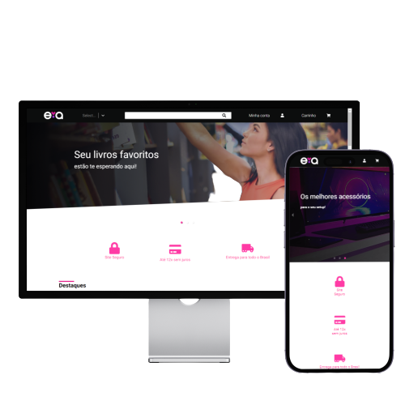

#  Eva Shop




# 📄 O que é a Eva Shop?

Eva Shop é o front end responsivo de um e-commerce, dentro da Eva Shop temos diversos produtos como acessórios para escritório, livros, jogos, roupas entre outros produtos.

# 🚩Para começar o projeto 
Precisa instalar o <a href='https://nodejs.org/en/'>Node<a/> e algum gerenciador de pacotes Node recomendado o <a href="https://www.npmjs.com">npm<a/>

# 👨‍💻 Instalação

```bash
# Clone this project
$ git clone https://github.com/JuaoPinheiro/evaavaliacao.git
# Access
$ cd evaavaliacao
# Install dependencies
$ yarn or npm 
# Run the project
$ yarn dev or npm start 
# The server will initialize in the <http://localhost:3000>
```

# 👾 Tecnologias usadas

* [ReactJs](https://pt-br.reactjs.org/)
* [JavaScript](https://www.javascript.com)
* [Vite](https://vitejs.dev)
* [Yarn](https://yarnpkg.com)
* [Carousel](https://www.npmjs.com/package/react-responsive-carousel)
* [Axios](https://axios-http.com/ptbr/docs/intro)
* [React Icon](https://react-icons.github.io/react-icons/)
* [Styled-Components](https://styled-components.com)

